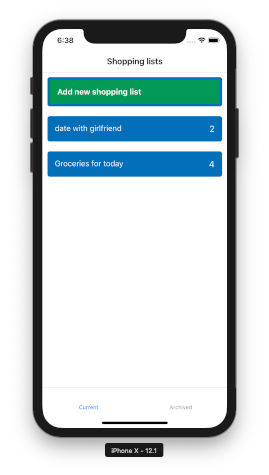
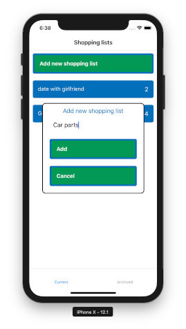
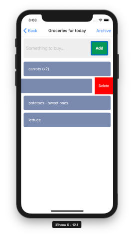

# Screenshots

# What is it

In this app I experimented with *redux-persist* and *AsyncStorage*.

# TODO ideas

 - icons,
 - fancy app name,
 - better styling and animations,
 - translations,
 - deleting shopping lists,
 - renaming shopping lists and entries,
 - on each Shopping list item: add counter view and two buttons to increment/decrement it,
 - when entering new entries names - autofilling from past entries history,
 - share functionality (for example to email app),
 - user accounts and synchronization (Firebase, Amazon AppSync, etc.),
 - **Flow** or **TypeScript** usage,
 - tests (unit and e2e),
 - extract common components to external packages.
